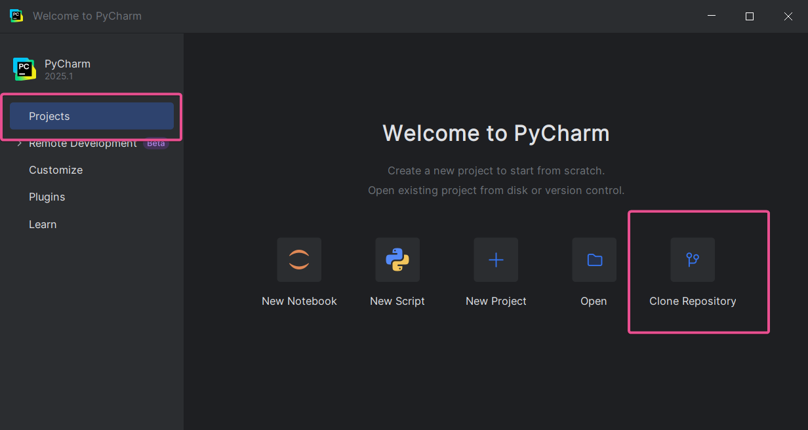
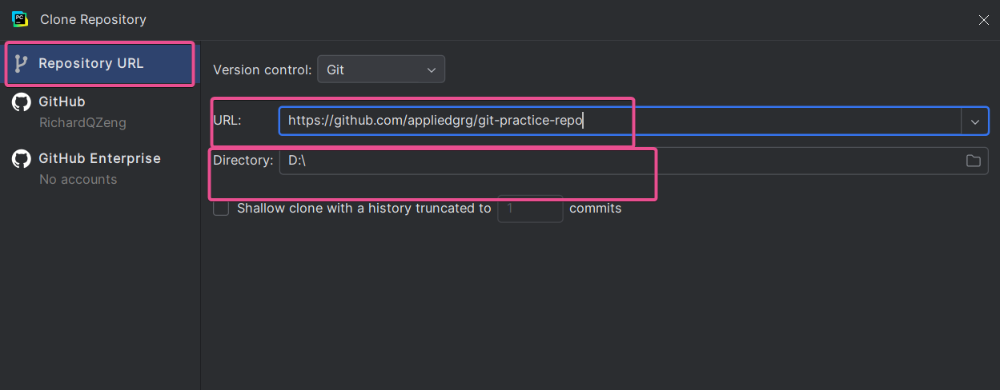
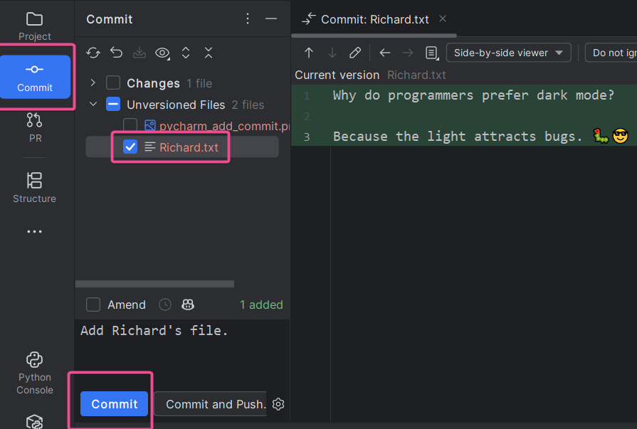
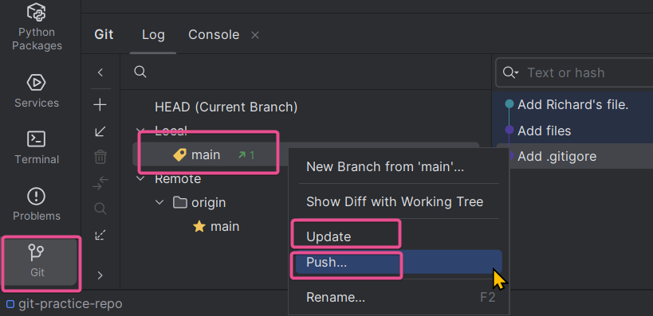

# GitHub practice!
Hello everyone! This is a fun dummy repository to practice your Gti/GitHub skills. We're going to be using GitHub a LOT, so it's important you get good at all of this.

- [GitHub practice!](#github-practice)
  - [Setting it Up](#setting-it-up)
  - [Cloning](#cloning)
  - [Adding Files](#adding-files)
  - [Committing](#committing)
  - [Pushing](#pushing)
  - [Pulling](#pulling)
  - [Merges](#merges)
  - [Branches](#branches)
    - [Creating a new branch](#creating-a-new-branch)
    - [Switching branches](#switching-branches)
    - [Pushing to that new branch](#pushing-to-that-new-branch)
    - [Merging to the Main Branch OR Pull Requests](#merging-to-the-main-branch-or-pull-requests)
      - [Merging to the Main Branch](#merging-to-the-main-branch)
      - [Pull Requests](#pull-requests)
  - [Returning to a previous commit](#returning-to-a-previous-commit)
  - [Common Conflicts and Fun Things](#common-conflicts-and-fun-things)
    - [Merge conflicts!](#merge-conflicts)
    - [Un-committing/Un-adding?](#un-committingun-adding)
    - [Deleting and moving files through Git](#deleting-and-moving-files-through-git)
    - [.gitignore](#gitignore)
    - [Git Tools](#git-tools)
    - [Helpful git commands](#helpful-git-commands)
  - [Test it out for yourself!](#test-it-out-for-yourself)


## Setting it Up
- [Download](https://git-scm.com/downloads/win) and install `git` onto your computer.
- We're using PyCharm for practice IDE. Please follow [Manage projects hosted on GitHub](https://www.jetbrains.com/help/pycharm/manage-projects-hosted-on-github.html) to setup and authorize PyCharm for GitHub. This will save your GitHub login information (in a secure way) on your computer, allowing you to seamlessly push/pull to/from your GitHub repositories from your local computer.

## Cloning
The FIRST thing you need to do is clone this repository onto your desktop. 

- Notes: What IS a repository? From GitHub's official tutorials, a repository "encompasses the entire collection of files and folders associated with a project, along with each file’s revision history."

What is cloning? Pretty much what it sounds like. All of the cool content in this DummyRepo is currently up on GitHub (in what's called a **remote repository**), and we want it on our computer (in a **local repository**). So, we need to *clone* a copy of it onto our computer! This also means that in order to clone a repo, you must be connected to the internet.

Launch PyCharm 2025.01, click Project and clone project will show up.



Fill repository URL and local directory. Repository URL:
> https://github.com/appliedgrg/git-practice-repo



Or in your terminal, you're going to want to type:
```bash
git clone https://github.com/appliedgrg/git-practice-repo
```
Basically, what this does is reaches out to GitHub and copies all of its contents into a *local repository* on your computer. 

Congrats! Now, you have a repository on your computer. 

## Adding Files
Adding files to a local repository is the exact same way you'd add files to a folder, however adding them to the remote repository on GitHub takes a few steps. For the sake of practice, make a .txt file using your name (if your name is John Smith, something like john_smith.txt will work). Write random content in the text file. 

Great job! Now, your local repository has a .txt file. Now, we also want to *change* the remote repository to reflect the updates we made. Before you add files, you should first remind yourself of what files you have added/changed in the first place. You can do this in PyCharm:



This will staging and commit in one step.

Or in terminal

```bash
git status
```

This command will list all of the files you changed in a color-coded fashion, but since you only added one file, only one file shows up. Now that you've reminded yourself of the file(s) you wanted to add, you can stage the changes, by:

```bash
git add (your full name here).txt
```

When you add files, you're **staging** them for commit, and you're beginning to **track** them. You can also stage files regardless of internet connection since it isn't uploading or downloading anything. Tracking files in git is super convenient- once they're tracked, you can see previous edits and versions. 

Now, once we add and stage them for commit, we actually need to commit!

## Committing

The git tutorial describes committing your changes as "taking a snapshot of the changes to include them in the project's history." After you finish a function or make a new class and commit, if at any point you mess up you can go back to your previous commits.

So, how do we commit? Any changes that you've *staged* (added) will be *committed* (become a part of the project's history) once you type:

```bash
git commit -m "my first commit!"
```

The `-m` is a very important part of the command. It designates that, the thing in quotations, is a *commit message*. With EVERY commit you **need** a commit message! (If you don't do -m, it'll take you to a weird screen to write your own commit message. -m is just easier.) Commit messages are just a helpful descriptor of what you changed and why the change was necessary, but really they can be anything you like.

Like staging files, committing does not require access to the internet; your changes are not actually uploaded until you push, which you'll learn about in the next section.

Another important note is that, if you do NOT add a file and commit, the file is not committed even if it is edited and saved. More on this later!

## Pushing
Then, once you've added your file and committed it, 



Or in terminal:

```bash
git push origin main
```
This final command updates the remote repository (origin) with any commits made locally to a branch (main). Things that are NOT committed will NOT be updated in the remote repository. 

Sweet! You've *pushed* your changes to the remote repository and now it has your fun .txt file!

As a note, since your remote repository is stored on GitHub, you will need an internet connection to do so.

## Pulling
Let's say that a ton of more people have ALSO written jokes and pushed them to the remote repository. Unfortunately, your own local repository does not have those changes! We can update our local repository with THIS: 

```bash
git pull origin main
```

This is great if you're working in a team and one of your teammates has made changes that they want to share to the group. 

Like pushing, you will need internet to pull from GitHub.

## Merges
Not only can you add new files, you can also edit existing ones and update them on the remote repository the exact same way you'd add new ones. Git will MERGE your local repository with the remote one, updating it.

Git is even smart enough to merge lines in the *same file*. Let's say Ryan and I are working on two separate parts of code in `file1.py`. I write a function called `hello_world()` and Ryan writes a function called `random_function()`. First, I do not have Ryan's function on my local repository and he doesn't have mine. But, we both decide to commit and push to the remote repository. Git will actually *merge* our two versions of `file1.py` to  make one with *both `hello_world()` and `random_function()`.* However, something to note is that if multiple people edit the the same lines/sections at once and try to push their commits, you might get an error called a **merge conflict**. More on that later!

## Branches
Let's say you're working on a bit of an *ambitious project* that you're not sure will work or not, and, while you want to commit your changes, you don't want to update the remote repository and lose the old work. Another cool feature of GitHub is making different **branches**.

### Creating a new branch
First, let's start with creating our branch with:
```bash
git checkout -b (branch name)
```
To see all of your branches, `git branch -v` will list all of them. You should see a `main` branch and your own branch. 

### Switching branches
To switch between branches, we use the `checkout` command.

```bash
git checkout (branch name)
```

An important note about working on branches! Any changes you make to one branch will NOT effect the other branch. So, if you add a bunch of files to one branch, your main branch will have no idea those files exist. Likewise, you can delete, rename, edit, anything you'd like on a branch and have your other branches stay the exact same.

To double-check what branch you're on, simply type:

```bash
git branch
```

### Pushing to that new branch
Committing and adding to different branches is the exact same! However, pushing requires a bit of effort. If you try to simply push, you'll get an error. Instead, you'll want to write:

```bash
git push origin (branch name)
```
Origin designates what remote we are pushing to and branch indicates what branch we're pushing from.

### Merging to the Main Branch OR Pull Requests
You've now edited your code on your separate branch and it was successful! Time to merge back into the main branch. If you're working on your **own code**, you can just merge back to the main branch with no trouble. However, if you're working on **code with others** you'll want to make a pull request instead.

Pull requests are done through GitHub itself and not through Git. In your repository, at the top of the page you will see a tab that says "Pull requests" where you can make a new pull request. Pull requests are useful especially on larger/critical projects where every commit needs to be verified before being added to the code.

#### Merging to the Main Branch
First, we switch back to the main branch:

```bash
git checkout main 
```

Next, we merge them with this simple command:

```bash
git merge (branch name) 
```

If you feel so inclined to delete your previous branch, use:
```bash
git branch -d (branch name) 
```

Now, the branches are merged on YOUR computer. It's time to update the remote repository to reflect that! Just like we're pushing from a branch, add and commit and finally push like this:

```bash
git push origin main 
```

Congrats, you've merged the branches successfully!

#### Pull Requests
If you're working on a project, instead of just merging you need to make a **pull request**. To make a pull request, (after your branch is committed and up to date) go on github, head to the project repo, find "pull requests" and open a new one, describing why the pull request is necessary. The person who runs the repo would then decide if your request is good or not, and then either accept or reject. Read more about pull requests [here](https://help.github.com/articles/creating-a-pull-request/).

## Returning to a previous commit
Did you accidentally commit something that messed up a bunch of things? Do you wish you could go back in time to when your code (sort of) worked? Luckily, we have the ability to time travel (metaphorically) thanks to Github. So, first we need to see all of our old commits to decide which one to go back to. Type out: 

```bash
git log 
```

You'll see bunch of commits, commit messages, and **commit hashes** (the things that look like `12345678901234567890123456789012345678ab`) These are important! Find the commit hash of the commit you want to go back to, and then type out:

```bash
git checkout (commit hash) .
```

The . is important, as it sets your branch to the current one. Finally, commit your changes and your repository should be reset!

**Important note:** Returning to a previous commit will only "rewind" the TRACKED FILES (deleted ones, renamed ones, as long as they're tracked!). Any files that are NOT tracked will not be reset.

## Common Conflicts and Fun Things

### Merge conflicts!
Let's say Ryan and I are both editing a file. We both pull the changes to the repository and decide to work on the same file. However, I decide that I want to update variable `x` to be equal to 5 whereas Ryan updates `x` to be equal to 7. We both change the SAME line in the code, and then decide to push/pull our changes.

```python
<<<<<<< HEAD
x = 5
=======
x = 7
>>>>>>> my_branch
print (x)
```

Now we get a merge conflict! What does this mean, exactly? Well, git is usually pretty smart about being able to merge changes. If Ryan and I edit two separate variables/functions/chunks of code even if it's on the same file, git can usually merge it. However, if we both make conflicting changes (editing the SAME line to two different things, editing nearby lines, etc.) git gets thrown. Git actually EDITS my file to show me where I messed up. 

Luckily, this is an easy fix. Delete the `<<<<<<< HEAD` and the `=======` and the `>>>>>>> my_branch`, and then pick which edit you'd like to use. Re-push, and you should be good! Some code editors like Visual Studio Code will actually highlight the merge conflicts and give you a dialog so you can quickly pick the version you would like!

**Note**: Jupyter Notebooks are **NOT** git friendly in this sense, so good practice is that people do not work on the same notebook at the same time because merge conflicts will **BREAK** your notebooks.

Now that we know what merge conflicts are, let's try to create one. We can do this by creating two branches that conflict with each other and then trying to merge them.

First, create a new branch, but do not checkout to the new branch.

```bash
git branch (insert name of branch here)
```

Edit your joke text file from earlier, stage it, and commit it. Now, checkout to the branch you created by running:

```bash
git checkout (name of the branch you just created)
```

Like before, change the file **on the same line(s) that you just changed**, stage it, and commit it. Then, checkout to the main branch, and when you run:

```bash
git merge (name of the branch you just created)
```
you should be getting an error, telling you:

```
CONFLICT (content): Merge conflict in (filename here)
Automatic merge failed; fix conflicts and then commit the result.
```

Now, if you close and reopen the text file you were modifying, you should see a merge conflict like the one shown above. Pick the version you would like to keep, stage it, and commit it. Your merge conflict is now solved!

### Un-committing/Un-adding?
Uh oh I did NOT mean to commit that file. Luckily, if you want to un-commit, just switch to a previous commit (detailed in the section above).

**Un-adding** is another thing you can do! There are a few ways to do this that depend on the situation. Usually, if you type `git status` it'll tell you all the files staged for commit, and tell you what to do if you want to un-stage a file for commit. It'll most likely be one of these commands:
 - `git rm --cached (file)`
 - `git reset HEAD (file)`
 - `git checkout --(file)`

### Deleting and moving files through Git
If you want make sure git is tracking all your changes, it's good practice to delete and move files through git. 
`git rm (filename)` will remove files and `git mv (file_from) (file_to)` will move them.

### .gitignore
Git defines files as three types: Tracked, untracked, and ignored. **ignored** files are files that git explicitly ignores. In order to designate a file as being ignored, you need to go into the .gitignore file by hand and add a path to that file. There are specific patterns on how to do this, so I'd recommend reading [this](https://www.atlassian.com/git/tutorials/saving-changes/gitignore) article.

### Git Tools
Github is so popular that most IDE's have integrated it! For example, some can track what files are committed, find merge conflicts for you, and much more! If you prefer using an IDE for coding, it is a good idea to see what git features it has.

### Helpful git commands
 * `git add -u` - add all TRACKED files
 * `git add .` - add every file in the directory.
 * ` upstream ` - sets relationship between branches to save keystrokes
 * `git status` - see what files are staged, modified, or untracked
 * `git status -uno` - see what files are staged and modified of all the tracked files 
 * `git diff` - show the changes between commits, commit and working tree, etc
 * `git init` - creates a .git file and signals that this directory is a repository. **Do not make a repository within another repository, it can lead to come confusion**

## Test it out for yourself!
This is the dummy repo so feel free to wreak some havoc on it. Push, pull, make as many branches as you'd like, whatever you feel will get you the most practice! 

Here are some links to check out some more fun stuff to do with Github. Google cool github tricks, etc. Explore and have fun!
- https://git-scm.com/book/en/v2
- https://help.github.com/articles/github-glossary/
- https://guides.github.com/
